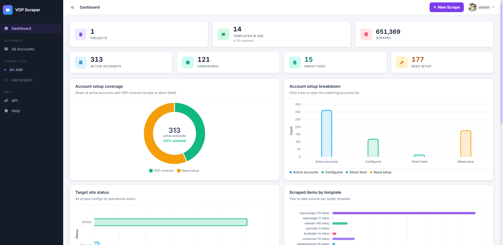
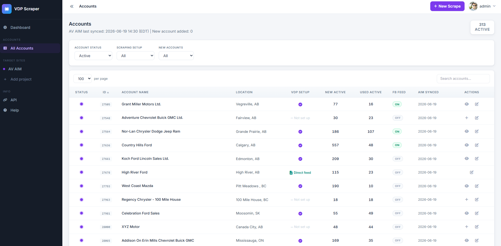
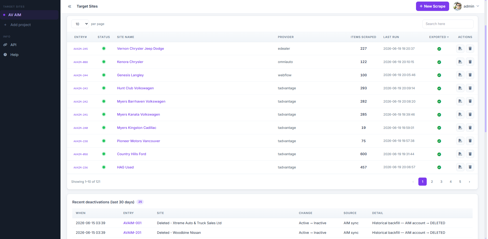
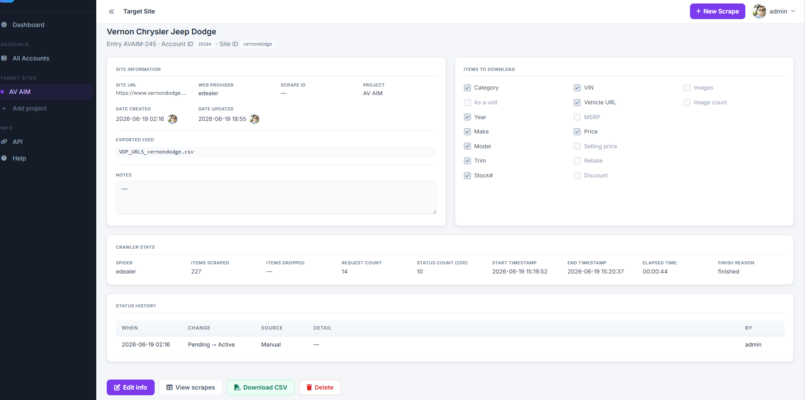
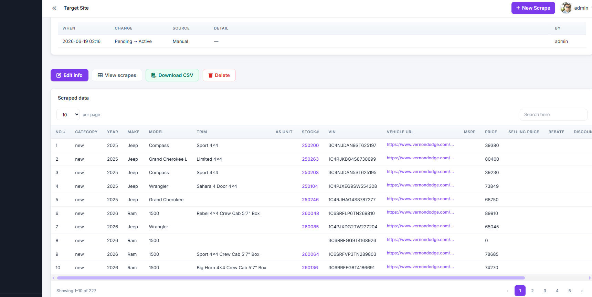
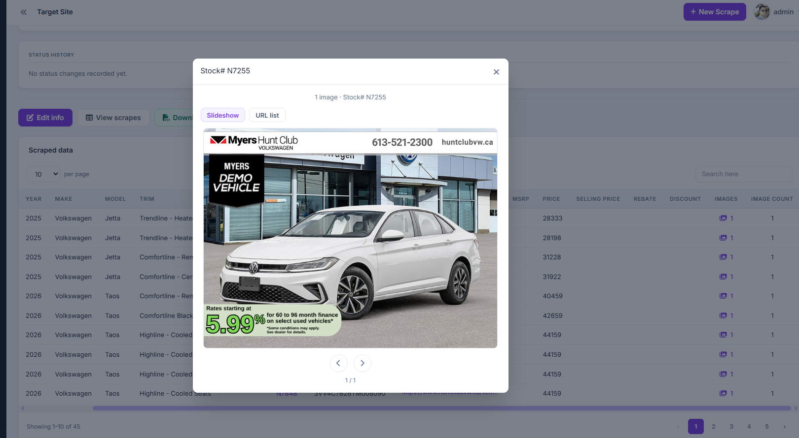
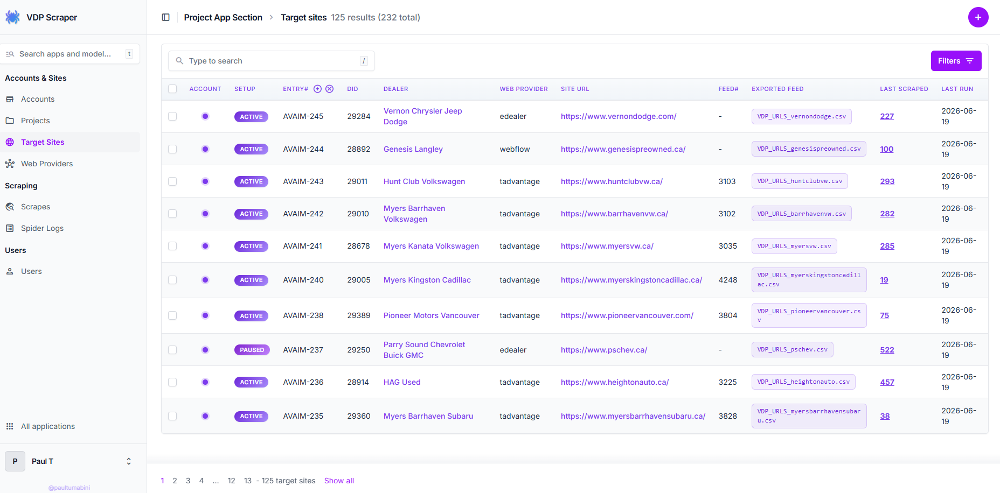

# VDP Scraper

Django app for managing dealer **vehicle detail page (VDP)** scraping: accounts synced from AIM, target sites, spider templates, crawl stats, and a dashboard for monitoring scrape volume. Scrapy spiders live under `scrapebucket/` and persist results through Django pipelines.

## Screenshots

| Dashboard | Accounts |
| --- | --- |
|  |  |

| Target sites | Target site detail |
| --- | --- |
|  |  |

| Scrape items | Image capture |
| --- | --- |
|  |  |

| Django admin |
| --- |
|  |

## What it does

1. **Sync accounts** from the AIM Admin API (`manage.py sync_accounts`) so dealer records, inventory stats, and feature flags stay current.
2. **Configure target sites** — one scrape config per dealer URL, mapped to a spider template (WordPress theme, Dealer Inspire, eDealer, etc.).
3. **Run crawls** via `runspider.py` — spiders extract VIN, price, URL, images, and other fields into the `Scrape` model.
4. **Monitor and export** — dashboard KPIs, per-site last-run status, FTP CSV export, and a REST API for downstream systems.

## Features

- **Web dashboard** — KPIs, account setup coverage, target-site status, and YTD volume by spider template.
- **30+ dealer spiders** — WordPress themes, Dealer Inspire, eDealer, Reynolds, Convertus/Trader, JSON APIs, and Selenium/Playwright for JS-heavy sites.
- **Account registry** — AIM sync, direct-feed vs scrape-required flags, and inactive-account handling.
- **REST API** — Integrations under `project/api/` (in-app reference at `/api-docs/`).
- **Ops hooks** — FTP export of VDP CSVs, per-crawl `SpiderLog` stats, status-event audit trail, and cron-friendly `runspider.py`.

## Ideal workflow

| Step | Who | Action |
| --- | --- | --- |
| 1 | Ops / cron | `sync_accounts` pulls latest dealer list from AIM. |
| 2 | Operator | Review new accounts flagged `is_new_account`; set **VDP data source** to _Requires scrape setup_ or _Direct feed_. |
| 3 | Operator | Create a **target site** — pick account, listing URL, spider template, and export fields. |
| 4 | Dev / ops | Add or tune a spider under `scrapebucket/spiders/` if the dealer platform is new. |
| 5 | Cron | `runspider.py -s <template>` crawls all active targets for that template. |
| 6 | Operator | Check **Last Run** on the target site detail page; open a ticket if exports stop updating after a site redesign. |

In-app help and FAQ: `/help/` after starting the dev server.

## Stack

Python 3.9+ · Django · Scrapy · Django REST Framework · PostgreSQL (SQLite works locally)

Optional browser automation: Selenium, Playwright (`scrapy-playwright`)

## Repository layout

```
├── images/                      # README screenshots
├── fixtures/                    # Sample / initial data
├── logs/                        # Spider log output (create as needed)
├── project/                     # Main Django app (models, views, admin, API, templates)
├── scrapebucket/                # Scrapy project root
│   ├── runspider.py             # Twisted/Scrapy runner — sequential crawls from DB targets
│   └── scrapebucket/            # Scrapy package
│       ├── django_setup.py      # Idempotent Django bootstrap
│       ├── settings.py          # Scrapy settings + Django bootstrap
│       ├── pipelines.py         # Persists items → Scrape model
│       ├── middlewares.py       # Downloader/spider middlewares, Selenium drivers
│       ├── urls_crawl.py        # Maps TargetSite records to spider classes
│       └── spiders/             # One module per dealer platform (~30 spiders)
├── static/                      # CSS, JS
├── users/                       # Auth and user-facing views
├── webscraping/                 # Django project (settings, URLs, WSGI/ASGI)
├── manage.py
└── requirements.txt
```

## Quick start (local)

```bash
git clone https://github.com/paultumabini/vehicle-detail-page-scraper.git
cd vehicle-detail-page-scraper
python3 -m venv venv
source venv/bin/activate
pip install -r requirements.txt

venv/bin/python manage.py migrate
venv/bin/python manage.py createsuperuser
venv/bin/python manage.py runserver
```

Open [http://127.0.0.1:8000/](http://127.0.0.1:8000/) for the dashboard. Admin: `/admin/`.

### Environment variables

Documented in `webscraping/settings.py`. Defaults work for local dev with `DEBUG=True`.

| Variable | Purpose |
| --- | --- |
| `DJANGO_SECRET_KEY` | Required when `DEBUG=False` |
| `POSTGRES_*` / `DB_*` | Database connection |
| `AVAIM_EMAIL`, `AVAIM_PASS` | AIM Admin API — needed for `sync_accounts` |
| `AIM_FTP_*` | FTP export of VDP CSV files |

### Sync accounts (optional locally)

```bash
export AVAIM_EMAIL=you@example.com AVAIM_PASS=secret
venv/bin/python manage.py sync_accounts
venv/bin/python manage.py sync_accounts --dry-run
```

## Running spiders

From the repository root:

```bash
venv/bin/python scrapebucket/runspider.py -s <spider_name>   # one template, all active targets
venv/bin/python scrapebucket/runspider.py -s all             # every active target
```

Spider names match template slugs (e.g. `edealer`, `convertus`, `wp_astra`).

## Tests

```bash
venv/bin/python manage.py test project
```

## License / contact

Project by **paultumabini** — [github.com/paultumabini/vehicle-detail-page-scraper](https://github.com/paultumabini/vehicle-detail-page-scraper).
